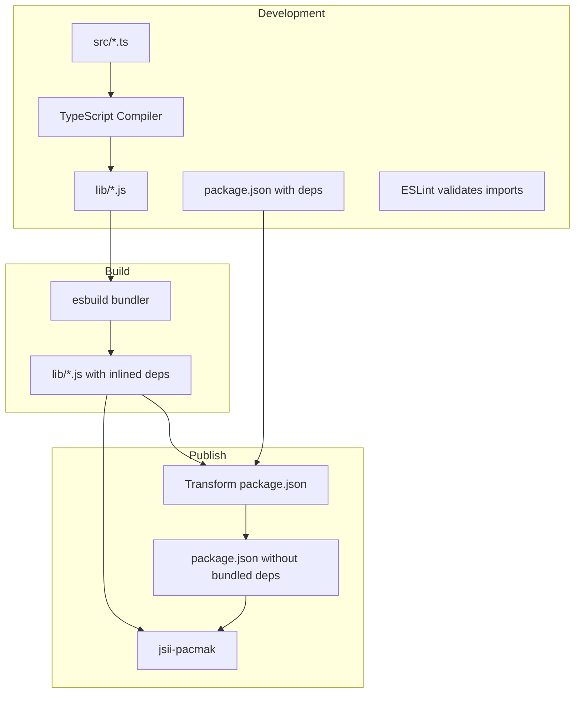
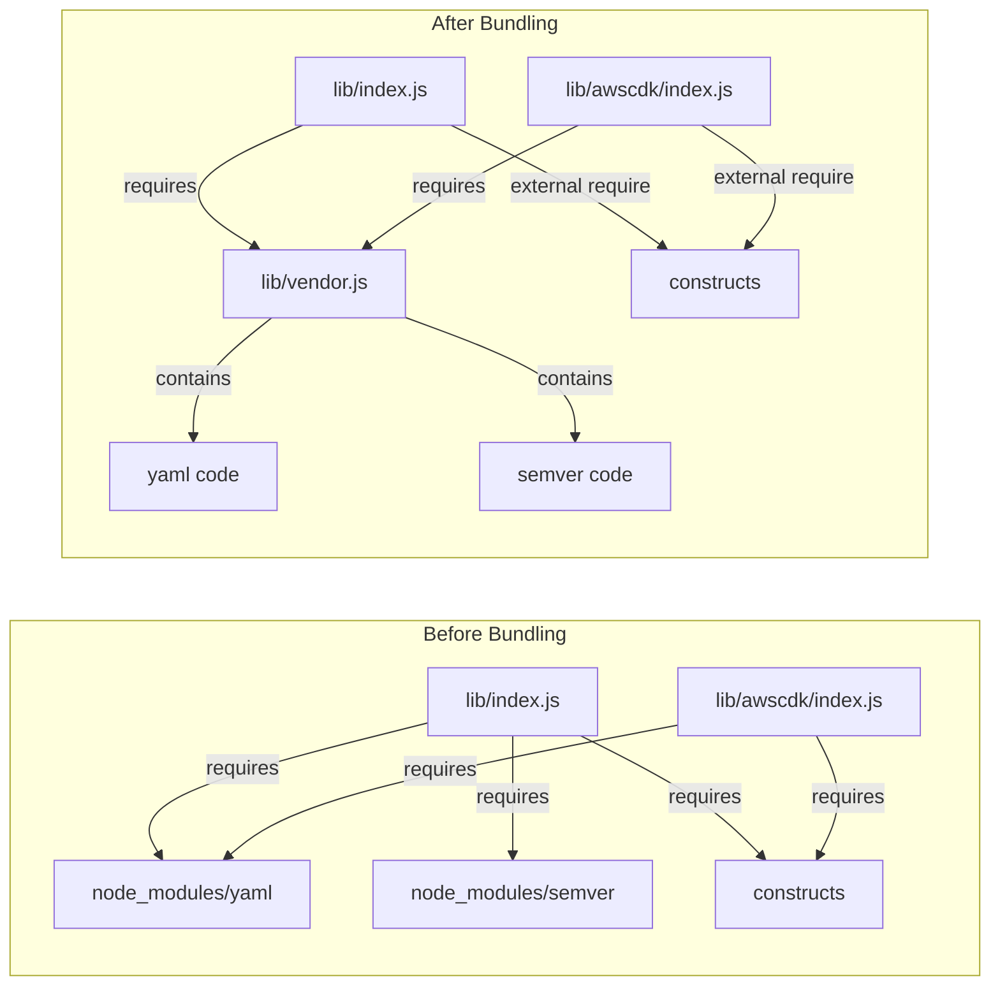
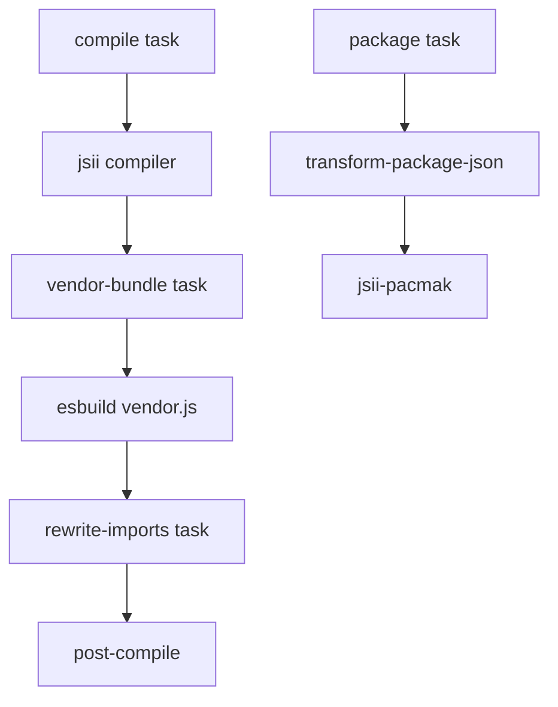

# Design Document: Dependency Bundling Strategy

## Overview

This design document describes a new approach to bundling dependencies in projen that replaces the current `bundledDependencies` npm feature with build-time bundling using esbuild. The new strategy bundles dependencies directly into the compiled JavaScript output files, removes them from the published package.json, and maintains them during development for tooling support.

The key insight is that projen is a developer tool (CLI), making it an ideal candidate for pre-bundling dependencies as described in the e18e community guidelines. This approach:
- Eliminates Yarn PnP compatibility issues
- Enables tree-shaking to reduce bundle size
- Prevents npm from attempting to install bundled dependencies
- Maintains the existing file structure for deep import compatibility

## Architecture



### Bundling Strategy

The bundling approach creates a **vendor bundle** containing all bundled dependencies, which is then referenced by the source files. This avoids code duplication while maintaining the file structure for deep imports.

**Two-phase approach:**

1. **Vendor Bundle Phase**: Bundle all bundled dependencies into a single `lib/vendor.js` file using esbuild
2. **Rewrite Phase**: Rewrite imports in compiled `lib/*.js` files to reference the vendor bundle instead of node_modules

This approach:
- Avoids duplicating dependency code across files
- Maintains the existing file structure for deep imports
- Keeps bundle size minimal through tree-shaking
- Allows esbuild to deduplicate shared code within the vendor bundle



**Alternative: Re-export Pattern**

Another approach is to create a vendor module that re-exports bundled dependencies:

```javascript
// lib/vendor.js (bundled)
export { parse as yamlParse, stringify as yamlStringify } from 'yaml';
export { default as semver } from 'semver';
// ... other bundled deps
```

Source files would then import from the vendor module:
```javascript
// lib/index.js (rewritten)
const { yamlParse } = require('./vendor');
```

This requires a build step to:
1. Analyze which exports from bundled deps are actually used
2. Generate the vendor module with only used exports (tree-shaking)
3. Rewrite imports in source files to use the vendor module

## Components and Interfaces

### 1. DependencyBundler Component

A new component that manages the bundling of dependencies at build time using a vendor bundle approach.

```typescript
interface DependencyBundlerOptions {
  /**
   * List of dependencies to bundle into the vendor bundle.
   * These will be inlined during build and removed from published package.json.
   */
  readonly bundledDeps: string[];
  
  /**
   * Dependencies that should remain external (not bundled).
   * @default ['constructs']
   */
  readonly externalDeps?: string[];
  
  /**
   * Output directory for bundled files.
   * @default 'lib'
   */
  readonly outdir?: string;
  
  /**
   * Name of the vendor bundle file.
   * @default 'vendor.js'
   */
  readonly vendorFile?: string;
  
  /**
   * Enable tree-shaking to minimize bundle size.
   * @default true
   */
  readonly treeShake?: boolean;
  
  /**
   * Target Node.js version for bundling.
   * @default 'node16'
   */
  readonly target?: string;
}

class DependencyBundler extends Component {
  constructor(project: NodeProject, options: DependencyBundlerOptions);
  
  /**
   * The task that creates the vendor bundle.
   */
  readonly vendorBundleTask: Task;
  
  /**
   * The task that rewrites imports to use the vendor bundle.
   */
  readonly rewriteImportsTask: Task;
  
  /**
   * The task that transforms package.json for publishing.
   */
  readonly transformPackageJsonTask: Task;
}
```

### 2. PackageJsonTransformer

A utility that transforms package.json for publishing by removing bundled dependencies.

```typescript
interface PackageJsonTransformOptions {
  /**
   * Dependencies to remove from the dependencies field.
   */
  readonly removeDeps: string[];
  
  /**
   * Whether to remove the bundledDependencies field entirely.
   * @default true
   */
  readonly removeBundledDependencies?: boolean;
}

class PackageJsonTransformer {
  /**
   * Transform package.json for publishing.
   * @param packageJson The original package.json content
   * @param options Transformation options
   * @returns The transformed package.json content
   */
  static transform(
    packageJson: Record<string, unknown>,
    options: PackageJsonTransformOptions
  ): Record<string, unknown>;
  
  /**
   * Restore package.json to development state.
   * @param packageJson The transformed package.json
   * @param originalDeps The original dependencies to restore
   * @returns The restored package.json content
   */
  static restore(
    packageJson: Record<string, unknown>,
    originalDeps: Record<string, string>
  ): Record<string, unknown>;
}
```

### 3. Build Task Integration

The bundling integrates into the existing projen task workflow:



**Vendor Bundle Generation:**
1. Analyze all source files to find imports from bundled dependencies
2. Generate a vendor entry point that re-exports all used symbols
3. Bundle the vendor entry point with esbuild (tree-shaking enabled)
4. Output to `lib/vendor.js`

**Import Rewriting:**
1. Scan all `lib/*.js` files for requires of bundled dependencies
2. Rewrite those requires to reference `./vendor.js` (with correct relative path)
3. Preserve all other requires unchanged

## Data Models

### BundleConfiguration

```typescript
interface BundleConfiguration {
  /**
   * Vendor entry point file (generated).
   */
  vendorEntryPoint: string;
  
  /**
   * Output file for vendor bundle.
   */
  vendorOutfile: string;
  
  /**
   * External packages (not bundled).
   */
  external: string[];
  
  /**
   * esbuild platform.
   */
  platform: 'node';
  
  /**
   * esbuild format.
   */
  format: 'cjs';
  
  /**
   * esbuild target.
   */
  target: string;
  
  /**
   * Enable tree-shaking.
   */
  treeShaking: boolean;
  
  /**
   * Bundled dependency names.
   */
  bundledDeps: string[];
}
```

### TransformResult

```typescript
interface TransformResult {
  /**
   * The transformed package.json content.
   */
  packageJson: Record<string, unknown>;
  
  /**
   * Dependencies that were removed.
   */
  removedDeps: string[];
  
  /**
   * Path to backup of original package.json.
   */
  backupPath?: string;
}
```

## Correctness Properties

*A property is a characteristic or behavior that should hold true across all valid executions of a system-essentially, a formal statement about what the system should do. Properties serve as the bridge between human-readable specifications and machine-verifiable correctness guarantees.*

### Property 1: Bundled Code Self-Containment

*For any* source file that imports a bundled dependency, after bundling, the vendor bundle SHALL contain all necessary code from that dependency, and the source file SHALL reference the vendor bundle instead of node_modules, such that the output can execute without the original dependencies being installed.

**Validates: Requirements 1.1, 1.3, 6.2, 6.3**

### Property 2: Package.json Transformation Correctness

*For any* bundled dependency in the original package.json, after transformation for publishing, the dependency SHALL NOT appear in the `dependencies` field, the `bundledDependencies` field SHALL be removed, and only external dependencies (constructs) SHALL remain in `dependencies`.

**Validates: Requirements 2.1, 2.2, 2.4, 8.1**

### Property 3: File Structure Preservation

*For any* source file in the `src/` directory, after bundling, there SHALL exist a corresponding output file in `lib/` at the same relative path, maintaining all exports and enabling the same deep import paths to resolve correctly.

**Validates: Requirements 4.1, 4.2, 4.3, 4.4**

### Property 4: Transformation Integrity

*For any* package.json transformation, all fields except `dependencies` and `bundledDependencies` SHALL be preserved unchanged, and the transformation SHALL be reversible by restoring the original dependency values.

**Validates: Requirements 8.2, 8.4**

## Error Handling

### Bundling Errors

| Error Condition                         | Handling Strategy                                               |
| --------------------------------------- | --------------------------------------------------------------- |
| Missing dependency                      | Fail build with clear error message listing the missing package |
| Circular dependency in bundled code     | esbuild handles this automatically; warn if detected            |
| Incompatible dependency (native module) | Fail with error suggesting to mark as external                  |
| esbuild not installed                   | Fail with instructions to install esbuild                       |
| Invalid entry point                     | Fail with error listing the invalid file path                   |

### Transformation Errors

| Error Condition              | Handling Strategy                             |
| ---------------------------- | --------------------------------------------- |
| package.json not found       | Fail with clear error message                 |
| Invalid JSON in package.json | Fail with parse error details                 |
| Backup file already exists   | Warn and overwrite, or fail if in strict mode |
| Restore without backup       | Fail with error explaining no backup exists   |

### Runtime Errors

| Error Condition                          | Handling Strategy                                 |
| ---------------------------------------- | ------------------------------------------------- |
| Bundled code references missing external | Runtime error with clear module not found message |
| Version mismatch in bundled code         | N/A - bundled code is self-contained              |

## Testing Strategy

### Unit Tests

Unit tests verify specific examples and edge cases:

1. **PackageJsonTransformer tests**
   - Transform removes specified dependencies
   - Transform preserves other fields
   - Restore correctly restores dependencies
   - Edge case: empty dependencies object
   - Edge case: no bundledDependencies field

2. **BundleConfiguration tests**
   - Configuration generates correct esbuild arguments
   - External dependencies are properly excluded
   - Entry points are correctly resolved

### Property-Based Tests

Property-based tests verify universal properties across many generated inputs using fast-check:

1. **Property 1: Bundled Code Self-Containment**
   - Generate random dependency configurations
   - Bundle and verify vendor.js contains bundled deps
   - Verify source files reference vendor.js for bundled deps
   - Minimum 100 iterations

2. **Property 2: Package.json Transformation Correctness**
   - Generate random package.json structures with various dependencies
   - Transform and verify bundled deps are removed
   - Minimum 100 iterations

3. **Property 3: File Structure Preservation**
   - Generate random source file structures
   - Bundle and verify output structure matches
   - Minimum 100 iterations

4. **Property 4: Transformation Integrity**
   - Generate random package.json with various fields
   - Transform and restore, verify equality
   - Minimum 100 iterations

### Integration Tests

1. **End-to-end bundling test**
   - Create a test project with bundled dependencies
   - Run build
   - Verify bundled output works without node_modules

2. **Yarn PnP compatibility test**
   - Install bundled package in Yarn PnP environment
   - Verify it functions correctly

3. **Deep import test**
   - Bundle projen
   - Verify all documented deep imports resolve correctly

### Test Configuration

- Property-based testing library: **fast-check**
- Minimum iterations per property test: **100**
- Test tag format: **Feature: dependency-bundling-strategy, Property {number}: {property_text}**
