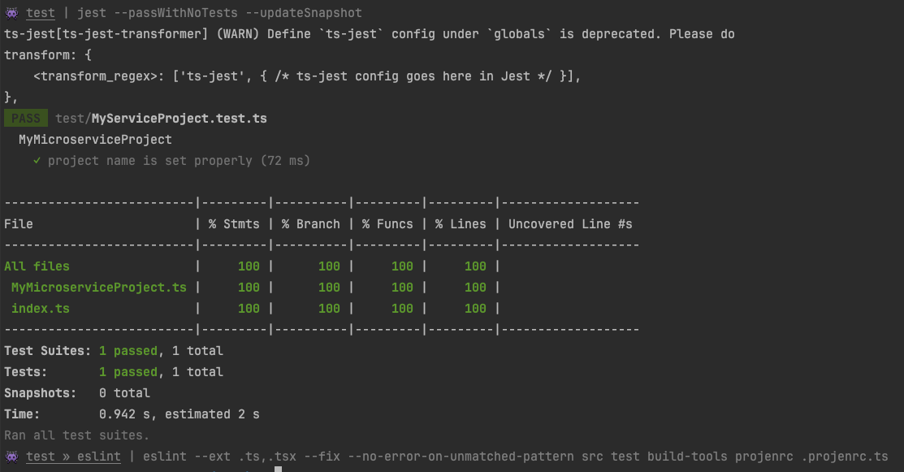
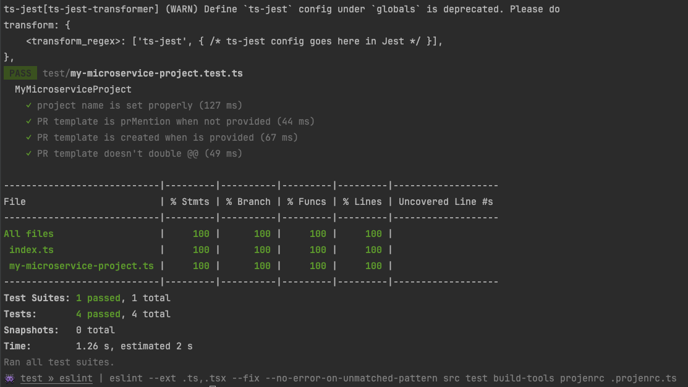

# Building your own project type

Projects are a collection of components that represent a codebase. Projects often, but don't have to, represent:

* The dependency management system for your codebase
* Any baseline project files like a package.json, pom.xml, or requirements.txt
* GitHub or other automation workflow files
* .gitignore and .npmignore files
* Sample files to get developers started with a working codebase.

Projects are opinionated, but flexible. They are opinionated in that they have a specific set of components that are included by default, but they are flexible in that you can add or remove components as you see fit and tweak the configuration of those components.

projen ships with many projects, but you can also build your own. 
What you build can be based on an existing project or you can build something entirely new.

For example, you could build a project that represents your organization's baseline Node.js application. 
This would automatically define eslint, prettier, and other tools that your company uses.
It would also include workflows and automations that are specific to your organization. 
By doing so, you create a reusable and predictable baseline for your developers to use when starting new projects.

## Creating a new project

All projen projects are [jsii](https://github.com/aws/jsii) projects, and you can use projen to create a new projen project.
You start by creating a new jsii project:

```shell
$ npx projen new jsii
```

This will create a new jsii project in the current directory. 
Open the directory in your favorite editor.

You'll likely want to start by editing the jsii project itself.
Open the .projenrc.ts file.

```typescript
import { cdk } from 'projen';
const project = new cdk.JsiiProject({
  author: 'The Sample Author',
  authorAddress: 'someone@somewhere.com',
  defaultReleaseBranch: 'main',
  jsiiVersion: '~5.0.0',
  name: 'ExampleProjenProject',
  projenrcTs: true,
  repositoryUrl: 'https://github.com/someone/ExampleProjenProject.git',

  // deps: [],                /* Runtime dependencies of this module. */
  // description: undefined,  /* The description is just a string that helps people understand the purpose of the package. */
  // devDeps: [],             /* Build dependencies for this module. */
  // packageName: undefined,  /* The "name" in package.json. */
});
project.synth();
```

## Setting the metadata

You'll likely want to start by editing the author, authorAddress, and repositoryUrl, if the defaults don't work for you.

It's recommended you also set the `description` to a meaningful value that represents what your library focuses on.
For example, if you are writing a project type that represents a Node.js-based microservice deployed via Kubernetes, you could set the description to "A Node.js-based microservice deployed via Kubernetes". Remember that you can have multiple projects in your library, so you don't want to narrow things down too much.

## Adding the projen dependency

Because we are creating a projen project, we need to add the projen dependency to the project.
This is also true for the `constructs` dependency, which is a peer dependency of projen.
Add 'projen' and 'constructs' to the `peerDeps` array:

```typescript
import { cdk } from 'projen';
const project = new cdk.JsiiProject({
  // ...
  peerDeps: ['constructs', 'projen'],
});
project.synth();
```

Since we've changed the contents of the .projenrc.ts file, go ahead and re-run projen:

```shell
$ npx projen
```

## Creating the project type

The next step is creating a new class that represents your project type. 
Create a new file in the `src/` directory.
The filename should match the class name. 
This is common convention in TypeScript.
If your project is going to be called 'MyMicroserviceProject' then the file should be called `src/my-microservice-project.ts`.

Next, create a new class that extends `TypeScriptProject`. 
If you want to use a different existing project type, you can extend that instead. 
If you want to start from scratch, you can extend `Project`. 

```typescript
import { TypeScriptProject, TypeScriptProjectOptions } from 'projen/lib/typescript';

export interface MyMicroserviceProjectOptions extends TypeScriptProjectOptions {}

export class MyMicroserviceProject extends TypeScriptProject {
  constructor(options: MyMicroserviceProjectOptions) {
    super(options);
  }
}
```

It's ok that this doesn't really do anything yet. We're just getting started.

## Exporting the project type

While the class defined above is exported, you must also export it from the directory.
If you don't export it then it won't be picked up by the jsii compiler and you won't get a package.

To do this, open the `src/index.ts` file. 
It will look like this:

```typescript
export class Hello {
  public sayHello() {
    return 'hello, world!';
  }
}
```

But get rid of all that, we don't need it.
Replace it with:

```typescript
export * from './my-microservice-project';
```

## Creating a test

It's always a good idea to create a test for your project type. 
Tests should validate that the options passed to your project are used properly by your code.

There was already a test created in the `test/hello.test.ts` file. 
But, we don't need that. 
Rename the file to match the project type we're testing, since we're going to test the `MyMicroserviceProject` project type,
call the file `test/my-microservice-project.test.ts`. 
The `test.ts` suffix is important, as it tells jest that this is a test file.

We're going to write a simple test.
All it will do is verify that the project name is set correctly.

jsii projects use the [jest framework](https://jestjs.io/) by default.
To get the most out of testing, make sure you review the docs. 
Only the basics will be covered here.

Start by writing a test that verifies the project name is set correctly. 
Because we know there will be more tests in the future, we'll group them together with a `describe` block.

```typescript
import { synthSnapshot } from 'projen/lib/util/synth';
import { MyMicroserviceProject } from '../src';

describe('MyMicroserviceProject', () => {
  test('project name is set properly', () => {
    // GIVEN
    const project = new MyMicroserviceProject({
      name: 'my-microservice',
      defaultReleaseBranch: 'main',
    });

    // WHEN
    const snapshot = synthSnapshot(project);

    // THEN
    expect(snapshot['package.json']!.name).toBe(
      'my-microservice',
    );
  });
});
```

This test creates a new instance of the project, and then uses the utility function from `projen/lib/util/synth`
to generate a snapshot of the project.
Then, the `package.json` file is extracted from the snapshot and the `name` property is verified.

Run the test to make sure it passes:

```shell
$ npx projen test
```

You should get some results showing you the test passed as well as some code coverage numbers:



## Adding a PR template component

Let's add a [GitHub Pull Request template](https://docs.github.com/en/communities/using-templates-to-encourage-useful-issues-and-pull-requests/about-issue-and-pull-request-templates) to our project. 

projen ships with a [PullRequestTemplate](/docs/api/github#pullrequesttemplate-) component that can be used to add a PR template to your project. Start by creating a new instance of it inside our new project type's constructor:

```typescript
export class MyMicroserviceProject extends TypeScriptProject {
  constructor(options: MyMicroserviceProjectOptions) {
    super(options);

    new PullRequestTemplate(this.github!, {

    });
  }
}
```

But if we tried running this code, it would fail to synthesize with the following error:

```text
Error: There is already a file under .github/pull_request_template.md
```

This happens because the base project, `TypeScriptProject`, already defines a PR template.
We need to start by disabling that:

```typescript
export class MyMicroserviceProject extends TypeScriptProject {
  constructor(options: MyMicroserviceProjectOptions) {
    super({
      ...options,
      pullRequestTemplate: false,
    });
 
    new PullRequestTemplate(this.github!, {

    });
  }
}
```

This tells the base project not to create the PullRequestTemplate component so we can do it later.

The `PullRequestTemplate` component only has one option, the lines of text you'd like in the PR template.
Let's add a few:

```typescript
export class MyMicroserviceProject extends TypeScriptProject {
  constructor(options: MyMicroserviceProjectOptions) {
    super({
      ...options,
      pullRequestTemplate: false,
    });

    const lines = [
      '### What does this PR change?',
      '<!--- Describe your changes in detail -->',
    ];

    new PullRequestTemplate(this.github!, {
      lines: lines,
    });
  }
}
```

Let's also add an optional `prMention` property that will mention a specific user in the PR template.

We need to first update the `MyMicroserviceProjectOptions` interface in the `my-microservice-project.ts` file to:

```typescript
export interface MyMicroserviceProjectOptions extends TypeScriptProjectOptions {
  readonly prMention?: string;
}
```

Then, we write the logic code to handle `options.prMention` in the constructor, pushing new lines to the PR template if the property is set:

```typescript
export class MyMicroserviceProject extends TypeScriptProject {
  constructor(options: MyMicroserviceProjectOptions) {
    super({
      ...options,
      pullRequestTemplate: false,
    });

    const lines = [
      '### What does this PR change?',
      '<!--- Describe your changes in detail -->',
    ];

    if (options.prMention) {
      lines.push(`cc @${options.prMention.replace('@', '')}`);
    }

    new PullRequestTemplate(this.github!, {
      lines: lines,
    });
  }
}
```

Now, we can add the `prMention` property to the options object when we create a new instance of our project type:

```typescript
const project = new MyMicroserviceProject({
  name: 'my-microservice',
  defaultReleaseBranch: 'main',
  prMention: '@someuser',
});
```

## Testing the new PR template change

Of course, we need to test this change, so let's go back to our existing unit test file and add a new test. 
This test will verify that the PR template is set correctly.

```typescript
import { synthSnapshot } from 'projen/lib/util/synth';
import { MyMicroserviceProject } from '../src';

describe('MyMicroserviceProject', () => {
  test('project name is set properly', () => {
   // ... the existing test
  });

  test('PR template is prMention when not provided', () => {
    // GIVEN
    const project = new MyMicroserviceProject({
      name: 'my-microservice',
      defaultReleaseBranch: 'main',
    });

    // WHEN
    const snapshot = synthSnapshot(project);

    // THEN
    expect(snapshot['.github/pull_request_template.md']).toBe(
      [
        '### What does this PR change?',
        '<!--- Describe your changes in detail -->',
      ].join('\n'),
    )
  });
});
```

Now we also need to write a test for when the prMention property is set:

```typescript
import { synthSnapshot } from 'projen/lib/util/synth';
import { MyMicroserviceProject } from '../src';

describe('MyMicroserviceProject', () => {
  test('project name is set properly', () => {
    // ... the existing test
  });

  test('PR template is created when is provided', () => {
    // GIVEN
    const project = new MyMicroserviceProject({
      name: 'my-microservice',
      defaultReleaseBranch: 'main',
      prMention: 'someoone',
    });

    // WHEN
    const snapshot = synthSnapshot(project);

    // THEN
    expect(snapshot['.github/pull_request_template.md']).toBe(
      [
        '### What does this PR change?',
        '<!--- Describe your changes in detail -->',
        'cc @someoone',
      ].join('\n'),
    );
  });
});
```

And finally, one more test to make sure that any provided '@' in the `prMention` property doesn't result in a '@@':

```typescript
import { synthSnapshot } from 'projen/lib/util/synth';
import { MyMicroserviceProject } from '../src';

describe('MyMicroserviceProject', () => {
  test('project name is set properly', () => {
    // ... the existing test
  });

  test('PR template doesn\'t double @@', () => {
    // GIVEN
    const project = new MyMicroserviceProject({
      name: 'my-microservice',
      defaultReleaseBranch: 'main',
      prMention: '@someoone',
    });

    // WHEN
    const snapshot = synthSnapshot(project);

    // THEN
    expect(snapshot['.github/pull_request_template.md']).toBe(
      [
        '### What does this PR change?',
        '<!--- Describe your changes in detail -->',
        'cc @someoone',
      ].join('\n'),
    );
  });
});
```

Now we've got good tests in place to verify our code is working as expected.
But let's make one more change that should make things a little cleaner. 
Right now we've got a few lines of code directly in the constructor of our new project type, but this will grow over 
time and become harder to maintain. Let's refactor things a little bit. 

Go back to the project type, and let's move all of our PR code into a new protected method:

```typescript
export class MyMicroserviceProject extends TypeScriptProject {
  constructor(options: MyMicroserviceProjectOptions) {
    super({
      ...options,
      pullRequestTemplate: false,
    });

    this.createPullRequestTemplate(options);
  }

  protected createPullRequestTemplate(options: MyMicroserviceProjectOptions) {
    const lines = [
      '### What does this PR change?',
      '<!--- Describe your changes in detail -->',
    ];

    if (options.prMention) {
      lines.push(`cc @${options.prMention.replace('@', '')}`);
    }

    new PullRequestTemplate(this.github!, {
      lines: lines,
    });
  }
}
```

And to make sure we didn't break anything after this refactor, let's run the tests again:

```shell
$ npx projen test
```



There you go! 
We've got a new project type that adds a PR template to our project.
We could keep adding additional components and build this out for all our needs, but I think this is good to illustrate the point.


