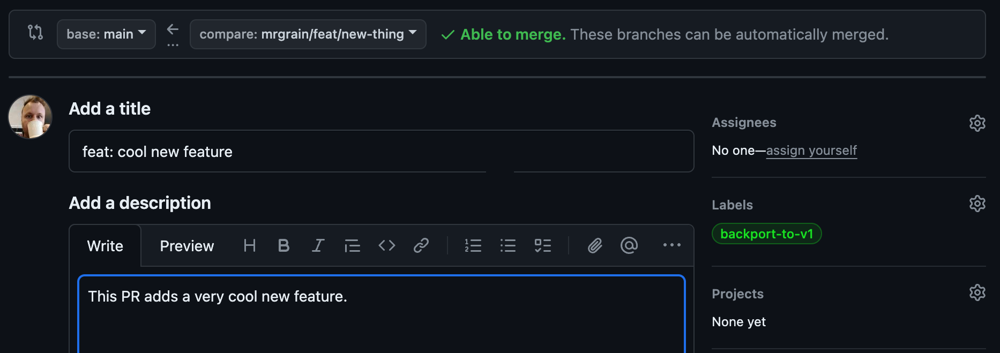
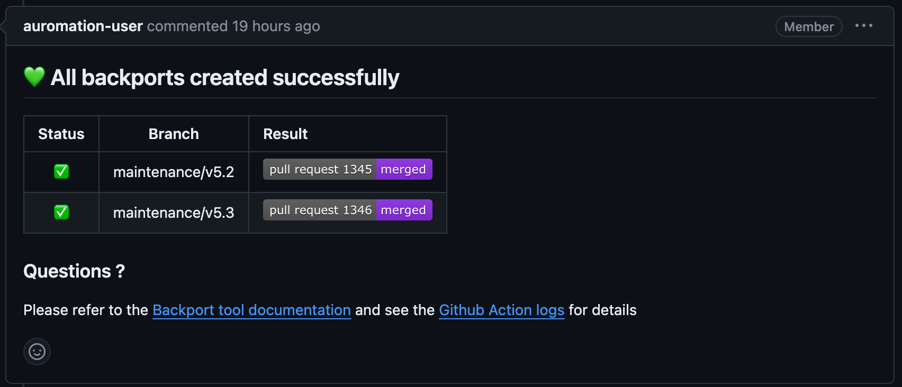
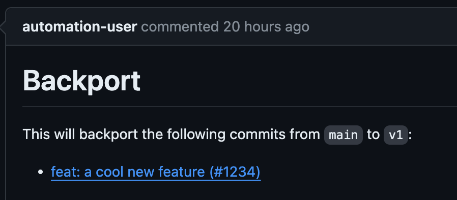

# Backporting Pull Requests

When working in projects with multiple [Release Branches](../../publishing/releases-and-versioning.md#release-branches),
it is often necessary to backport features or fixes from the current branch to a previous version line.
Projen makes this very easy with automatic backporting based on pull request labels.
When configured, just add the label `backport-to-v1` to a pull request, and the PR will be automatically backported to the `v1` branch.

:::info
Projects using Mergify (enabled by default) should instead use [Mergify's backport action](https://docs.mergify.com/workflow/actions/backport/).
This documentation describes an alternative approach using GitHub Actions.
It is not recommended to use both features together in the same project.
:::

## Enable backports

To get started, set `githubOptions.pullRequestBackport` to `true`:

```ts
const { javascript } = require('projen');

const project = new javascript.NodeProject({
  // ...other options
  githubOptions: {
    pullRequestBackport: true,
  },
});
```

## Workflow

The backporting workflow is based on pull requests and pull requests labels.
You will have to use pull requests to use this feature.

Create your features and fixes as usual.
When you are ready to open the pull requests, add a backporting label to it on the right hand side (location will differ on mobile).
The default format of the label is `backport-to-<target-branch>`,
i.e. to backport your PR to the `v1` branch, you need to add the label `backport-to-v1`.



Labels can be added at any time, including after a PR has been created or even after a PR has been merged.
It is also possible to add multiple labels to a PR, and backport it to multiple target branches.

:::note
On GitHub, pull requests labels need to be created once.
After that, the label will come up in the list of suggestions.
:::

Now you continue with your development cycle, get the pull request reviewed and eventually merged.
At this point the workflow will become active again and acknowledge the creation of the backport PRs:



The comment includes a quick overview over all backports requested for the pull request, including the backport status (was there a conflict?), the target branches, and the status of the opened pull requests.

Click through to one of the backport pull requests, and you will be presented with a short summary of the backport.
The labels of this pull request will include `backport`, and if auto approvals are enabled also `auto-approve`.



And that's already it. You have now successfully backported a pull request.
If you are using auto approvals, the backport PR will merge itself if it passes the build automation.
Otherwise it's now time for you to review the backport or make any further changes to it.

## Configuration

The backport component comes with sensible defaults and integrations with other projen features like release branches or auto approvals.
However it can be further customized to the needs of individual projects.

### Target branches

Pull requests can only be backported onto a pre-defined list of target branches.
By default, this list contains the project's release branches and the default branch.
However it only works if release management is enabled for the project, which is enabled by default for the root projects, but not for subprojects.
Alternatively, the list of target branches can be provided manually:

```ts
const { javascript } = require('projen');

const project = new javascript.NodeProject({
  githubOptions: {
    pullRequestBackport: true,
    pullRequestBackportOptions: {
      branches: ["beta", "prod"],
    }
  },
  // ...other options
});
```

### Auto-approve backports

By default, backport pull requests will be approved and merged automatically if the 'auto approve' feature is enabled on the project.
This behavior can be disabled if needed:

```ts
const { javascript } = require('projen');

const project = new javascript.NodeProject({
  autoApproveOptions: {}, // enable auto-approve
  githubOptions: {
    pullRequestBackport: true,
    pullRequestBackportOptions: {
      autoApproveBackport: false, // disable backport auto-approve
    }
  },
  // ...other options
});
```

### Conflicts

Sometimes backporting will cause a conflict with the target branch.
By default, a pull request will still be created and left for maintainers to resolve.
If desired, this behavior can be disabled:

```ts
const { javascript } = require('projen');

const project = new javascript.NodeProject({
  githubOptions: {
    pullRequestBackport: true,
    pullRequestBackportOptions: {
      createWithConflicts: false,
    }
  },
  // ...other options
});
```

### Names & Labels

Workflow, label and branch names ship with sensible defaults.
If needed, these can be updated to different values.

:::note
The `backportBranchNamePrefix` and `labelPrefix` options should include a separator character at the end, like `/` or `-`.
This makes it easier to disambiguate between the prefix and the branch name.
:::

```ts
const { javascript } = require('projen');

const project = new javascript.NodeProject({
  githubOptions: {
    pullRequestBackport: true,
    pullRequestBackportOptions: {
      workflowName: "copy",
      backportBranchNamePrefix: "copy/",
      labelPrefix: "copy-to-",
      backportPRLabels: ["copy"],
    }
  },
  // ...other options
});
```
