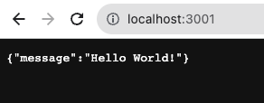

# Rest API with Node.js

In this example, we'll guide you through create a Node.js API using [express](https://expressjs.com/).

Start by creating a new directory for your project and then using projen to create a new project:

```shell
npx projen new node
```

Open the project in your favorite editor. You'll see a number of files and directories have been created:

```text
.
├── .git
├── .gitattributes
├── .github
├── .gitignore
├── .idea
├── .mergify.yml
├── .npmignore
├── .projen
├── .projenrc.js
├── LICENSE
├── README.md
├── node_modules
├── package.json
└── yarn.lock
```

We'll start by making some changes to the .projenrc.js file. This file is the main configuration file for your project.
The file is generated with only the minimal amount of code needed:

```javascript
const { javascript } = require("projen");
const project = new javascript.NodeProject({
  defaultReleaseBranch: "main",
  name: "node-js-api",

  // deps: [],                /* Runtime dependencies of this module. */
  // description: undefined,  /* The description is just a string that helps people understand the purpose of the package. */
  // devDeps: [],             /* Build dependencies for this module. */
  // packageName: undefined,  /* The "name" in package.json. */
});
project.synth();
```

We can start with a simple change, editing the `name` of the project, which starts as the directory name. 
We'll change it to "my-node-api":

```javascript
const { javascript } = require("projen");
const project = new javascript.NodeProject({
  defaultReleaseBranch: "main",
  name: "my-node-api",

  // deps: [],                /* Runtime dependencies of this module. */
  // description: undefined,  /* The description is just a string that helps people understand the purpose of the package. */
  // devDeps: [],             /* Build dependencies for this module. */
  // packageName: undefined,  /* The "name" in package.json. */
});
project.synth();
```

Now, re-run projen:

```shell
npx projen
```

projen regenerates all files, and the only change we see is the "name" in the package.json is now updated:

```text
 const { javascript } = require("projen");
 const project = new javascript.NodeProject({
   defaultReleaseBranch: "main",
-  name: "node-js-api",
+  name: "my-node-api",

```

Next, we'll add the express dependency to our project. We do this by adding it to the `deps` array:

```javascript
const { javascript } = require("projen");
const project = new javascript.NodeProject({
  defaultReleaseBranch: "main",
  name: "my-node-api",

  deps: ['express'],
  // description: undefined,  /* The description is just a string that helps people understand the purpose of the package. */
  // devDeps: [],             /* Build dependencies for this module. */
  // packageName: undefined,  /* The "name" in package.json. */
});
project.synth();
```

Since we've made a change to the .projenrc.js file, we need to re-run projen:

```shell
npx projen
```

:::tip
If you know you're going to be making a lot of changes to the .projenrc.js file, you can use the `--watch` option to have projen automatically:

```shell
npx projen --watch
```
:::

This will update the package.json file with the new `express` dependency and then run the package manager ([yarn](https://yarnpkg.com/) by default)
to install it.

Now, let's add some code to our project. We'll start by creating a new directory called `src` and a new file called `index.js`:

```javascript
const express = require('express');
const app = express();
const port = 3001;

app.get('/', (req, res) => {
  res.json({message: 'Hello World!'});
});

app.listen(port, () => {
  console.log(`Example app listening on port ${port}`);
});
```

We can start the app now using node:

```shell
node src/index.js
```

However, this isn't very convenient and doesn't align with standard practices in Node.js. 
Instead, let's create a new task in projen to run the app:

```javascript
const { javascript } = require("projen");
const project = new javascript.NodeProject({
  defaultReleaseBranch: "main",
  name: "my-node-api",

  deps: ['express'],
  // description: undefined,  /* The description is just a string that helps people understand the purpose of the package. */
  // devDeps: [],             /* Build dependencies for this module. */
  // packageName: undefined,  /* The "name" in package.json. */
});

project.addTask('start', {
  receiveArgs: true,
  exec: 'node src/index.js'
})

project.synth();
```

The `exec` field just defines the shell command to run. The `receiveArgs` field tells projen to pass any arguments through
to the command. This is useful if you want to pass additional arguments to the node command, like `--inspect` for example.


:::info
From here on out, we're going to assume that you know that you need to re-run projen after making changes to the .projenrc.js file, and we're not going to explicitly call it out anymore.
:::

Now, we can run our app using the new task:

```shell
pj start
```

For Node.js projects, tasks are standard package.json scripts, so you can also use npm, pnpm, or yarn to run the task:

```shell
npm run start
pnpm start
yarn start
```

Once we have the task running, the website should load in your browser at [http://localhost:3001](http://localhost:3001).



That's it! Real simple, but should cover the main workflow for creating a new project. 
Try exploring some of the options of the NodeProject type to see what else you can do.
There are plenty there and the documentation on each field will tell you what it does. 
Try setting the `license` option to 'MIT' and see what happens when you run `npx projen`.
