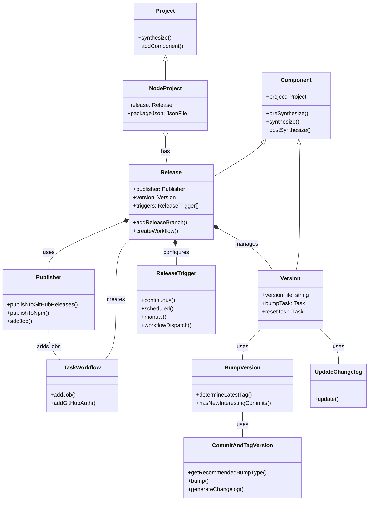
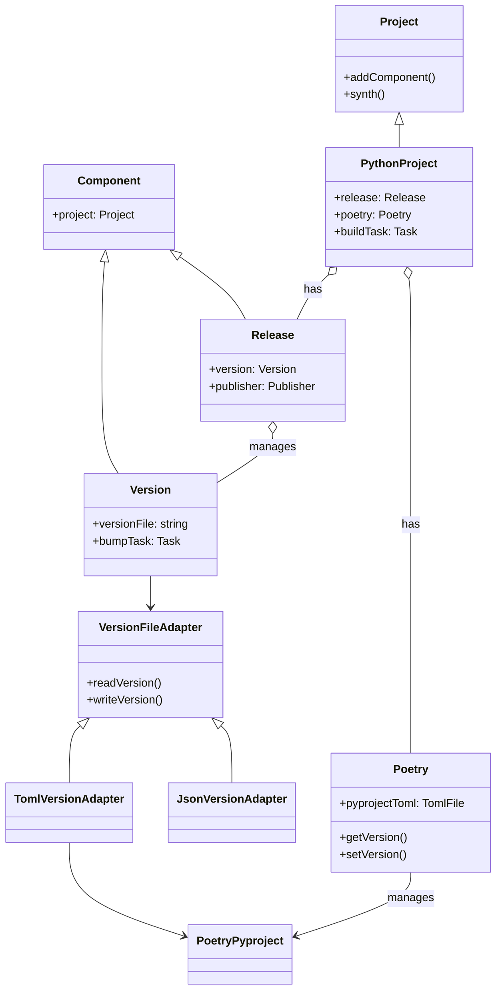
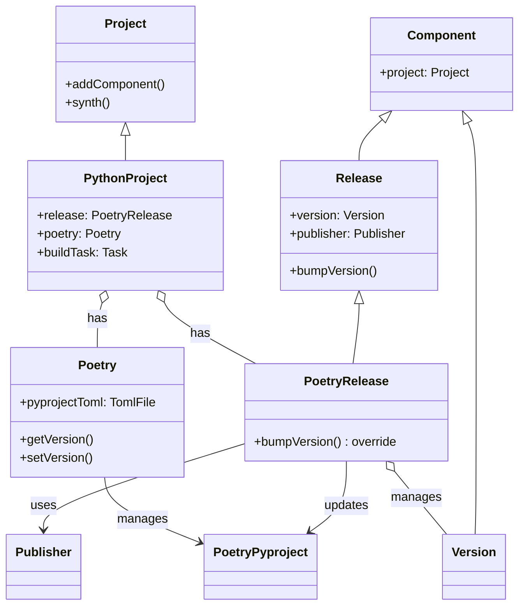
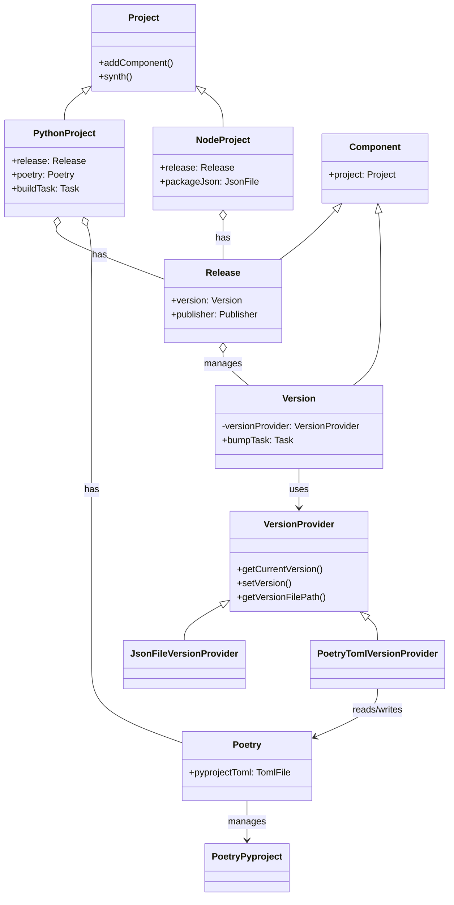

# GitHub Release Automation for Poetry projects

> **Author**: [@bhrutledge](https://github.com/bhrutledge), **Status**: Draft

This RFC proposes an enhancement to projen's release automation system to support Python Poetry projects, addressing the issue described in <https://github.com/projen/projen/discussions/4078>.

## Problem Statement

Currently, projen's `Release` component requires a JSON version file for version management, which is incompatible with Poetry's use of `pyproject.toml`. This causes several issues:

1. Poetry projects cannot effectively use the `Release` component
2. Version management is inconsistent between the release process and Poetry
3. Built Python packages may not have the correct version

## Current Release Automation Architecture

Projen's release automation system for Node projects consists of several interconnected components:

### Core Components

#### Release Class

The [`Release`](https://github.com/projen/projen/blob/main/src/release/release.ts) class orchestrates the entire release process, including:

- Creating GitHub workflows for release automation
- Coordinating version bumping and changelog generation
- Managing release artifacts and publishing targets

The Release component is typically initialized in the project constructor, as seen in [`NodeProject`](https://github.com/projen/projen/blob/main/src/javascript/node-project.ts):

```typescript
// Example from NodeProject
this.release = options.release && !this.parent
  ? new Release(this, {
      ...options.releaseOptions,
      task: this.buildTask,
      artifactsDirectory: this.artifactsDirectory,
      versionFile: "package.json",
      majorVersion: options.majorVersion,
      minMajorVersion: options.minMajorVersion,
      minor: options.minor,
      prerelease: options.prerelease,
      releaseBranches: options.releaseBranches,
      defaultReleaseBranch: options.defaultReleaseBranch,
      releaseTagPrefix: options.releaseTagPrefix,
      ghpages: options.releaseToGhPages,
    })
  : undefined;
```

#### Version Management

The [`Version`](https://github.com/projen/projen/blob/main/src/version.ts) class handles version bumping and tracking:

- Provides tasks for bumping and resetting versions
- Manages changelog generation
- Creates files that track the version and release tag

Version bumping is implemented through the [`BumpVersion`](https://github.com/projen/projen/blob/main/src/release/bump-version.ts) class, which:

- Determines the next version based on conventional commits
- Updates version files (like `package.json` for Node projects)
- Generates a changelog

#### Publisher

The [`Publisher`](https://github.com/projen/projen/blob/main/src/release/publisher.ts) class:

- Creates GitHub releases with assets
- Can publish to various package managers (npm, PyPI, Maven, etc.)
- Defines workflow jobs for publishing steps

### Visual Component Overview

The following diagram illustrates the relationships between the main components in the release system:



## Proposed Approaches for Poetry Support

### Approach 1: Version File Adapter

Create an abstraction layer that allows the `Version` component to work with different file formats:



#### Components

1. **VersionFileAdapter Interface**: Define operations for reading/writing versions
   - `readVersion(): string`
   - `writeVersion(version: string): void`

2. **JsonVersionAdapter**: Implementation for JSON files (existing behavior)
3. **TomlVersionAdapter**: Implementation for TOML files
   - Focus on Poetry's `pyproject.toml` format

#### Implementation Steps

1. Create the adapter interface and implementations
2. Modify `Version` class to use the adapter instead of direct file operations
3. Update `PythonProject` to create and use the appropriate adapter:

```typescript
export class PythonProject extends Project {
  constructor(options: PythonProjectOptions) {
    super(options);

    // ... other setup code ...

    if (options.poetry) {
      this.poetry = new Poetry(this, options.poetryOptions);

      if (options.release) {
        // Create the Poetry-specific adapter
        const tomlAdapter = new TomlVersionAdapter(this.poetry.pyprojectToml);

        // Pass adapter to the Release component
        this.release = new Release(this, {
          ...options.releaseOptions,
          versionFileAdapter: tomlAdapter,
        });
      }
    }
  }
}
```

4. Test with Poetry projects

#### Pros

- Maintains backward compatibility
- Extensible to other file formats
- Clean separation of concerns

#### Cons

- Requires refactoring existing code
- Potential for missed edge cases with TOML parsing

### Approach 2: Poetry-specific Release Component

Create a `PoetryRelease` component that inherits from `Release` but overrides version management:



#### Components

1. **PoetryRelease**: Extension of `Release` with Poetry-specific logic
   - Overrides version file operations
   - Adds Poetry-specific publishing

#### Implementation Steps

1. Create the `PoetryRelease` class that extends `Release`:

```typescript
export class PoetryRelease extends Release {
  private readonly poetry: Poetry;

  constructor(project: PythonProject, options: PoetryReleaseOptions) {
    super(project, {
      ...options,
      // Don't provide versionFile since we'll override version operations
      versionFile: undefined,
    });

    this.poetry = project.poetry;
  }

  // Override version management methods
  protected bumpVersion(nextVersion: string): void {
    // Update Poetry version in pyproject.toml
    this.poetry.setVersion(nextVersion);
    // Write version to other files as needed for the release process
    super.writeVersionFiles(nextVersion);
  }

  // Add Poetry-specific publishing methods
  public publishToPoetryRepository(options: PoetryPublishOptions) {
    // Implementation of Poetry publishing
  }
}
```

2. Override version manipulation methods as shown above
3. Add Poetry-specific publishing logic
4. Update `PythonProject` to use `PoetryRelease` when Poetry is enabled:

```typescript
export class PythonProject extends Project {
  constructor(options: PythonProjectOptions) {
    super(options);

    // ... other setup code ...

    if (options.poetry) {
      this.poetry = new Poetry(this, options.poetryOptions);

      if (options.release) {
        // Create Poetry-specific Release component
        this.release = new PoetryRelease(this, {
          ...options.releaseOptions,
          // Other Poetry-specific options
        });
      }
    }
  }
}
```

#### Pros

- Focused solution for Poetry
- Minimal changes to existing code

#### Cons

- Could lead to code duplication
- Less extensible for other formats

### Approach 3: Custom Version Provider

Add a provider pattern for version operations:



#### Components

1. **VersionProvider Interface**: Provides version information
   - `getCurrentVersion(): string`
   - `setVersion(version: string): void`
   - `getVersionFilePath(): string`

2. **JsonFileVersionProvider**: Default provider
3. **PoetryTomlVersionProvider**: Provider for Poetry projects

#### Implementation Steps

1. Create the `VersionProvider` interface that defines how versions are managed:

```typescript
export interface VersionProvider {
  // Gets the current version from whatever source it's stored in
  getCurrentVersion(): string;

  // Updates the version in the appropriate file format
  setVersion(version: string): void;

  // Gets the path to the file that contains the version
  getVersionFilePath(): string;
}
```

2. Implement concrete providers:
   - `JsonFileVersionProvider`: For standard JSON-based version files (default)
   - `PoetryTomlVersionProvider`: For reading/writing versions in Poetry's pyproject.toml

3. Modify `Version` class to use the provider:

```typescript
export class Version extends Component {
  private readonly versionProvider: VersionProvider;

  constructor(project: Project, options: VersionOptions) {
    super(project);

    // Use provided version provider or fallback to default
    this.versionProvider = options.versionProvider ||
      new JsonFileVersionProvider(project, options.versionFile || 'version.json');
  }

  // Use provider in all version operations
  protected getCurrentVersion(): string {
    return this.versionProvider.getCurrentVersion();
  }

  protected setVersion(version: string): void {
    this.versionProvider.setVersion(version);
  }
}
```

4. Update `PythonProject` to use the Poetry provider:

```typescript
export class PythonProject extends Project {
  constructor(options: PythonProjectOptions) {
    super(options);

    if (options.poetry) {
      this.poetry = new Poetry(this, options.poetryOptions);

      if (options.release) {
        // Create Poetry-specific version provider
        const versionProvider = new PoetryTomlVersionProvider(
          this, this.poetry
        );

        // Use standard Release with custom provider
        this.release = new Release(this, {
          ...options.releaseOptions,
          versionProvider,
          // No need for versionFile, as provider handles it
          versionFile: undefined,
        });
      }
    }
  }
}
```

5. Test with Poetry projects

#### Pros

- Clean design pattern
- Extensible for future use cases
- Less intrusive to existing code

#### Cons

- Additional abstraction layer
- Requires careful integration testing

## Recommended Approach

**Approach 3: Custom Version Provider** offers the best balance of maintainability and extensibility. This approach:

1. Makes minimal changes to core release functionality while being less intrusive than the Adapter pattern
2. Provides a clean extension point for other project types beyond just file format differences
3. Isolates Poetry-specific logic to its own class
4. Creates a clearer abstraction by focusing on version operations (getting/setting) rather than file manipulation
5. Follows a standard design pattern that's easier to understand and maintain long-term

**Approach 1 (Version File Adapter)** focuses more on file formats than operations, making it less flexible for future extensions beyond file differences.

**Approach 2 (Poetry-specific Release Component)** would be simpler to implement initially but could lead to code duplication and maintenance challenges as more project types are supported.

## Testing Strategy

1. **Unit Tests**:
   - Test each version provider in isolation
   - Verify version reading/writing works as expected
   - Test Poetry-specific edge cases

2. **Integration Tests**:
   - Create a full Poetry project
   - Run through the version bump process
   - Verify GitHub release creation
   - Ensure published packages have correct version

3. **Snapshot Tests**:
   - Update existing snapshots with new behavior
   - Add Poetry-specific test cases

## Future Improvements

1. **Additional Providers**: Create providers for other version storage mechanisms
2. **Enhanced Poetry Configuration**: Add Poetry-specific release options
3. **Custom Release Workflow**: Optimize workflow for Python package release process
