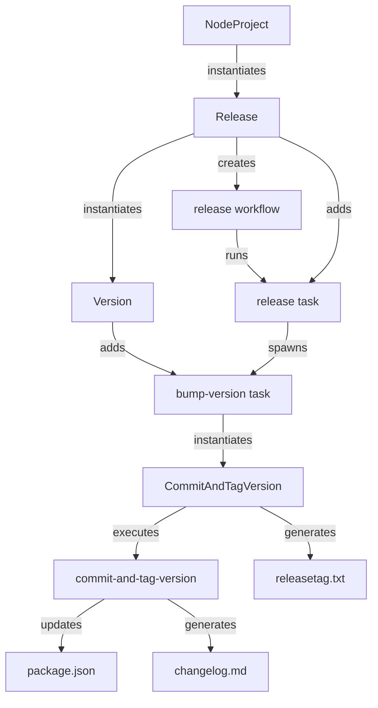

# GitHub Release Automation for Poetry projects

> **Author**: [@bhrutledge](https://github.com/bhrutledge), **Status**: Draft

This RFC proposes an enhancement to projen's release automation system to support Python Poetry projects, addressing the issue described in <https://github.com/projen/projen/discussions/4078>.

## Problem Statement

Currently, projen's `Release` component requires a JSON version file for version management, which is incompatible with Poetry's use of `pyproject.toml`. This causes several issues:

1. Poetry projects cannot effectively use the `Release` component
2. Version management is inconsistent between the release process and Poetry
3. Built Python packages may not have the correct version

## Current Release Automation Architecture

The [`Release`](../src/release/release.ts) class orchestrates the entire release process, including:

- Creating GitHub workflows for release automation
- Coordinating version bumping and changelog generation
- Managing release artifacts and publishing targets

The `Release` class is typically initialized in the project constructor, as seen in [`NodeProject`](../src/javascript/node-project.ts):

```typescript
this.release = new Release(this, {
  versionFile: "package.json", // this is where "version" is set after bump
  task: this.buildTask,
  branch: options.defaultReleaseBranch ?? "main",
  ...options,

  artifactsDirectory: this.artifactsDirectory,
  releaseWorkflowSetupSteps: [
    ...this.renderWorkflowSetup({
      installStepConfiguration: {
        workingDirectory: this.determineInstallWorkingDirectory(),
      },
      mutable: false,
    }),
    ...(options.releaseWorkflowSetupSteps ?? []),
  ],

  // ...other options
});
```

The `Release` class creates and manages an instance of the `Version` class, which:

- Provides tasks for bumping and resetting versions
- Manages changelog generation
- Creates files that track the version and release tag

Version bumping is implemented through a series of components:

- The [`Version`](../src/version.ts) component sets up projen tasks for version bumping and changelog generation
- The `bump` task uses code from [`bump-version.task.ts`](../src/release/bump-version.task.ts), which calls the [`bump`](../src/release/bump-version.ts) function
- The `bump` function uses the [`CommitAndTagVersion`](../src/release/commit-tag-version.ts) class, which wraps the [`commit-and-tag-version` npm package](https://www.npmjs.com/package/commit-and-tag-version/)
- This process updates version files (like `package.json` for Node projects) and generates changelogs based on conventional commits

### Version Bumping Process Flow



## Proposed Solution

Fortunately, the `commit-and-tag-version` package already [supports Poetry](https://github.com/absolute-version/commit-and-tag-version?tab=readme-ov-file#python-support).
We can leverage this existing capability with minimal changes to projen's codebase,
resulting in the same flow above, but with `PythonProject` and `pyproject.toml` instead of `NodeProject` and `package.json`.

The current implementation in the `CommitAndTagVersion` class hard-codes the version file type as `"json"`:

```typescript
const catvConfig: CommitAndTagConfig = {
  packageFiles: [
    {
      filename: this.options.versionFile,
      type: "json",
    },
  ],
  bumpFiles: [
    {
      filename: this.options.versionFile,
      type: "json",
    },
  ],
  // ... other options
};
```

However, the `commit-and-tag-version` package can [detect file types automatically](https://github.com/absolute-version/commit-and-tag-version/blob/400e3c17616cfc2481c5a17dad85c0d4d67a49f1/lib/updaters/index.js#L23-L51)
if the `type` property is omitted, e.g.:

```javascript
if (/pyproject.toml/.test(filename)) {
    return getUpdaterByType('python');
}
```

So, we should remove the `type` property from the configuration:

```typescript
const catvConfig: CommitAndTagConfig = {
  packageFiles: [
    {
      filename: this.options.versionFile,
    },
  ],
  bumpFiles: [
    {
      filename: this.options.versionFile,
    },
  ],
  // ... other options
};
```

Then, we can update the `PythonProject` class to create and configure a `Release` component when Poetry is enabled:

```typescript
export interface PythonProjectOptions
  extends GitHubProjectOptions,
    PythonPackagingOptions,
    PythonExecutableOptions,
    ReleaseProjectOptions {

  // Existing options...

  /**
   * Automatically release when new versions are introduced.
   * @default false
   */
  readonly release?: boolean;
}

export class PythonProject extends Project {
  constructor(options: PythonProjectOptions) {
    super(options);

    if (options.poetry) {
      this.poetry = new Poetry(this, options.poetryOptions);

      if (options.release) {
        this.release = new Release(this, {
          versionFile: 'pyproject.toml', // Use Poetry's pyproject.toml instead of package.json
          // ...other options
        });
      }
    }
  }
}
```
