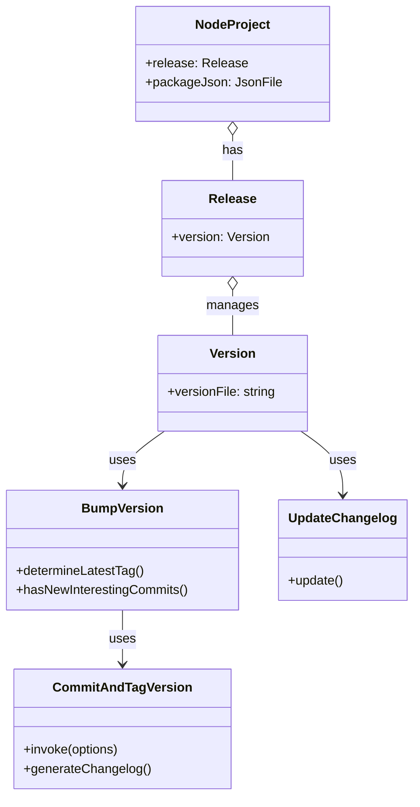
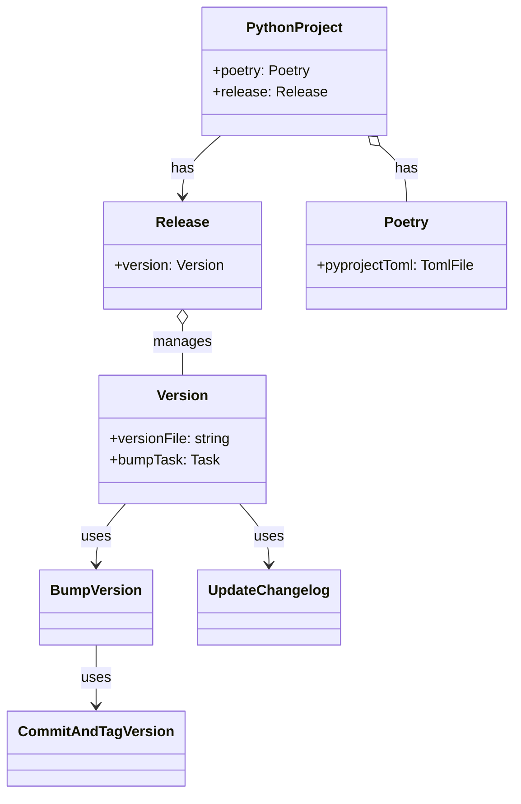

# GitHub Release Automation for Poetry projects

> **Author**: [@bhrutledge](https://github.com/bhrutledge), **Status**: Draft

This RFC proposes an enhancement to projen's release automation system to support Python Poetry projects, addressing the issue described in <https://github.com/projen/projen/discussions/4078>.

## Problem Statement

Currently, projen's `Release` component requires a JSON version file for version management, which is incompatible with Poetry's use of `pyproject.toml`. This causes several issues:

1. Poetry projects cannot effectively use the `Release` component
2. Version management is inconsistent between the release process and Poetry
3. Built Python packages may not have the correct version

## Current Release Automation Architecture

The [`Release`](../src/release/release.ts) class orchestrates the entire release process, including:

- Creating GitHub workflows for release automation
- Coordinating version bumping and changelog generation
- Managing release artifacts and publishing targets

The `Release` class is typically initialized in the project constructor, as seen in [`NodeProject`](../src/javascript/node-project.ts):

```typescript
// Example from NodeProject
this.release = options.release && !this.parent
  ? new Release(this, {
      ...options.releaseOptions,
      task: this.buildTask,
      artifactsDirectory: this.artifactsDirectory,
      versionFile: "package.json",
      majorVersion: options.majorVersion,
      minMajorVersion: options.minMajorVersion,
      minor: options.minor,
      prerelease: options.prerelease,
      releaseBranches: options.releaseBranches,
      defaultReleaseBranch: options.defaultReleaseBranch,
      releaseTagPrefix: options.releaseTagPrefix,
      ghpages: options.releaseToGhPages,
    })
  : undefined;
```

The `Release` class creates and manages an instance of the `Version` class, which:

- Provides tasks for bumping and resetting versions
- Manages changelog generation
- Creates files that track the version and release tag

Version bumping is implemented through the [`BumpVersion`](../src/release/bump-version.ts) class, which relies on the [`CommitAndTagVersion`](../src/release/commit-tag-version.ts) class:

- `BumpVersion` determines the next version based on conventional commits
- `CommitAndTagVersion` wraps the external `commit-and-tag-version` npm package
- Updates version files (like `package.json` for Node projects or `pyproject.toml` for Poetry)
- Generates changelogs based on conventional commits

### Visual Component Overview



## Proposed Solution

Fortunately, the `commit-and-tag-version` package already includes native support for Poetry's `pyproject.toml` format. We can leverage this existing capability with minimal changes to projen's codebase.



### Implementation

Update the `PythonProject` class to create and configure a `Release` component when Poetry is enabled:

```typescript
export interface PythonProjectOptions extends ProjectOptions {
  // Existing options...

  /**
   * Automatically release when new versions are introduced.
   * @default false
   */
  readonly release?: boolean;
}

export class PythonProject extends Project {
  constructor(options: PythonProjectOptions) {
    super(options);

    if (options.poetry) {
      this.poetry = new Poetry(this, options.poetryOptions);

      if (options.release) {
        // For Poetry projects, use pyproject.toml as the version file
        this.release = new Release(this, {
          ...options.releaseOptions,
          task: this.buildTask,
          versionFile: 'pyproject.toml',
          // Other release options carried over from options
          majorVersion: options.majorVersion,
          minMajorVersion: options.minMajorVersion,
          prerelease: options.prerelease,
          // etc.
        });
      }
    }
  }
}
```

Also, our current implementation in the `CommitAndTagVersion` class hard-codes the version file type as "json":

```typescript
const catvConfig: CommitAndTagConfig = {
  packageFiles: [
    {
      filename: this.options.versionFile,
      type: "json",
    },
  ],
  bumpFiles: [
    {
      filename: this.options.versionFile,
      type: "json",
    },
  ],
  // ... other options
};
```

We should be able to remove the `type` property and let `commit-and-tag-version` automatically detect the file type based on the filename, which would be more future-proof.

### Advantages

1. **Simplicity**: Leverages existing built-in support in `commit-and-tag-version`
2. **Minimal Changes**: Requires only minimal changes to the projen codebase
3. **No Dependencies**: No need to add TOML parsing libraries
4. **Consistency**: Maintains the same workflow for all project types
5. **Maintainability**: No custom updaters or adapters to maintain

## Testing Strategy

1. **Unit Tests**:
   - Verify `CommitAndTagVersion` correctly configures options for `pyproject.toml`
   - Test that version bumping works correctly

2. **Integration Tests**:
   - Create a full Poetry project
   - Run through the version bump process
   - Verify GitHub release creation
   - Ensure published packages have correct version
